# 🏦 Subbu Bank — Full-Stack Banking Application

## Project Documentation

---

## 1. Project Overview

**Subbu Bank** is a full-stack internet banking application that simulates core banking operations. It features a **Django REST Framework** backend with **JWT authentication**, a **React + Vite** frontend with a premium dark glassmorphism UI, and **role-based access control** across three user tiers.

| Attribute | Details |
|-----------|---------|
| **Project Name** | Subbu Bank |
| **Backend** | Python 3, Django 4.2, Django REST Framework |
| **Frontend** | React 18, Vite 7, React Router v6 |
| **Database** | SQLite (local dev), PostgreSQL via Neon (production) |
| **Authentication** | JWT (JSON Web Tokens) via `djangorestframework-simplejwt` |
| **Deployment** | Render (backend) + Vercel (frontend) |
| **Repository** | [github.com/subrahmanyamvenna/subbubank](https://github.com/subrahmanyamvenna/subbubank) |

---

## 2. Architecture


### Request Flow

1. User interacts with the **React frontend** (SPA)
2. Frontend sends API requests with **JWT Bearer tokens** to the Django backend
3. Django validates the token, checks **role-based permissions**, and queries the database
4. Response is returned as JSON → frontend renders the data

---

## 3. Role-Based Access Control (RBAC)

The system implements a three-tier user hierarchy:

```mermaid
graph TD
    SA["🛡️ Super Admin"]
    RM["👔 Relationship Manager"]
    C["👤 Customer"]

    SA -->|"Creates & Manages"| RM
    RM -->|"Creates & Manages"| C
    SA -->|"Views All"| C
```



### Permissions Matrix

| Feature | Super Admin | Relationship Manager | Customer |
|---------|:-----------:|:-------------------:|:--------:|
| View Dashboard | ✅ System-wide stats | ✅ Portfolio stats | ✅ Personal stats |
| Manage RMs | ✅ Create/View | ❌ | ❌ |
| Manage Customers | ✅ View all | ✅ Create/View own | ❌ |
| View Accounts | ❌ | ✅ Customer accounts | ✅ Own accounts |
| View Transactions | ❌ | ❌ | ✅ Own transactions |
| Banking Services | ❌ | ❌ | ✅ Apply & Track |

---

## 4. Backend Architecture

### 4.1 Technology Stack

- **Django 4.2** — Python web framework
- **Django REST Framework** — RESTful API toolkit
- **SimpleJWT** — JSON Web Token authentication
- **django-cors-headers** — Cross-Origin Resource Sharing
- **WhiteNoise** — Static file serving in production
- **Gunicorn** — WSGI HTTP server for production
- **psycopg** — PostgreSQL database adapter (v3)

### 4.2 Project Structure

```
backend/
├── manage.py                    # Django CLI entry point
├── seed_data.py                 # Dummy data generator
├── db.sqlite3                   # Local SQLite database
├── subbu_bank/                  # Django project config
│   ├── __init__.py
│   ├── settings.py              # Settings (JWT, CORS, DB, etc.)
│   ├── urls.py                  # Root URL routing
│   └── wsgi.py                  # WSGI application
└── accounts/                    # Main app
    ├── models.py                # Data models
    ├── serializers.py           # DRF serializers
    ├── views.py                 # API views
    ├── permissions.py           # Custom permission classes
    ├── urls.py                  # App URL routing
    └── admin.py                 # Django admin config
```

### 4.3 Data Models

#### User Model (extends Django `AbstractUser`)

| Field | Type | Description |
|-------|------|-------------|
| `username` | CharField | Login username |
| `email` | EmailField | Email address |
| `first_name` | CharField | First name |
| `last_name` | CharField | Last name |
| `role` | CharField | `superadmin`, `rm`, or `customer` |
| `phone` | CharField | Phone number |
| `address` | TextField | Residential address |
| `assigned_rm` | ForeignKey | RM assigned to this customer |

#### Account Model

| Field | Type | Description |
|-------|------|-------------|
| `user` | ForeignKey → User | Account owner |
| `account_number` | CharField | Unique 12-digit number (e.g., `SB2025000001`) |
| `account_type` | CharField | `savings`, `current`, or `salary` |
| `balance` | DecimalField | Current balance |
| `is_active` | BooleanField | Account status |

#### Transaction Model

| Field | Type | Description |
|-------|------|-------------|
| `account` | ForeignKey → Account | Associated account |
| `transaction_type` | CharField | `credit` or `debit` |
| `amount` | DecimalField | Transaction amount |
| `balance_after` | DecimalField | Balance after transaction |
| `description` | CharField | Transaction description |
| `reference_id` | CharField | Unique reference (e.g., `TXN8F2A1B3C`) |
| `timestamp` | DateTimeField | When it occurred |

#### ServiceRequest Model

| Field | Type | Description |
|-------|------|-------------|
| `user` | ForeignKey → User | Requesting customer |
| `service_type` | CharField | One of 6 service types |
| `status` | CharField | `pending`, `in_progress`, `completed`, `rejected` |
| `remarks` | TextField | Customer notes |

### 4.4 API Endpoints

| Method | Endpoint | Auth | Description |
|--------|----------|------|-------------|
| `POST` | `/api/token/` | ❌ | Login — returns JWT access + refresh tokens |
| `POST` | `/api/token/refresh/` | ❌ | Refresh an expired access token |
| `GET` | `/api/me/` | ✅ | Get current user's profile |
| `GET` | `/api/dashboard-stats/` | ✅ | Role-specific dashboard statistics |
| `GET/POST` | `/api/managers/` | ✅ SuperAdmin | List or create Relationship Managers |
| `GET/POST` | `/api/customers/` | ✅ SuperAdmin/RM | List or create Customers |
| `GET` | `/api/all-customers/` | ✅ SuperAdmin | List all customers system-wide |
| `GET` | `/api/accounts/` | ✅ Customer | List customer's bank accounts |
| `GET` | `/api/transactions/` | ✅ Customer | List transactions (filterable) |
| `GET/POST` | `/api/services/` | ✅ Customer | List or create service requests |
| `GET` | `/api/customers/:id/accounts/` | ✅ RM | View a customer's accounts |

### 4.5 Authentication Flow


### 4.6 Custom Permission Classes

```python
# permissions.py
IsSuperAdmin      → user.role == 'superadmin'
IsRelationshipManager → user.role == 'rm'
IsCustomer        → user.role == 'customer'
IsSuperAdminOrRM  → user.role in ('superadmin', 'rm')
```

---

## 5. Frontend Architecture

### 5.1 Technology Stack

- **React 18** — Component-based UI library
- **Vite 7** — Lightning-fast build tool
- **React Router v6** — Client-side routing with `NavLink` active states
- **Vanilla CSS** — Custom premium dark theme with glassmorphism

### 5.2 Project Structure

```
frontend/src/
├── main.jsx                     # App entry point
├── App.jsx                      # Router + ToastProvider
├── index.css                    # Global styles (premium dark theme)
├── api.js                       # JWT API client
├── utils.js                     # Formatting helpers
├── components/
│   ├── AppLayout.jsx            # Auth-guarded layout with sidebar
│   ├── Sidebar.jsx              # Role-based navigation
│   └── Toast.jsx                # Toast notification system
└── pages/
    ├── Login.jsx                # Login page
    ├── Dashboard.jsx            # Role-aware dashboard
    ├── Accounts.jsx             # Customer bank accounts
    ├── Statements.jsx           # Filterable transaction history
    ├── Services.jsx             # Banking services + request modal
    ├── ManageUsers.jsx          # Admin: manage RMs / RM: manage customers
    └── AllCustomers.jsx         # Admin: view all customers
```

### 5.3 Component Hierarchy


### 5.4 Routing

| Path | Component | Access |
|------|-----------|--------|
| `/` | `Login` | Public |
| `/dashboard` | `Dashboard` | All authenticated |
| `/accounts` | `Accounts` | Customer |
| `/statements` | `Statements` | Customer |
| `/services` | `Services` | Customer |
| `/manage-users` | `ManageUsers` | SuperAdmin, RM |
| `/all-customers` | `AllCustomers` | SuperAdmin |

### 5.5 API Client (`api.js`)

The API client handles:

- **Token storage** in `localStorage` (`sb_access`, `sb_refresh`, `sb_user`)
- **Auto-refresh** — if a request returns 401, it automatically refreshes the access token and retries
- **Environment-based URL** — uses `VITE_API_URL` env variable for production, falls back to `localhost:8000`
- **Error handling** — parses API errors and surfaces user-friendly messages

### 5.6 Design System

| Token | Value | Usage |
|-------|-------|-------|
| `--bg-primary` | `#0a0e1a` | Page background |
| `--bg-glass` | `rgba(255,255,255,0.04)` | Glassmorphism cards |
| `--gold` | `#daa520` | Primary accent (brand) |
| `--teal` | `#14b8a6` | Secondary accent |
| `--green` | `#22c55e` | Credits, success |
| `--red` | `#ef4444` | Debits, errors |
| Font | Inter (Google Fonts) | All text |

Features: **glassmorphism**, **animated gradient background**, **smooth hover transitions**, **responsive layout** (sidebar collapses on mobile).

---

## 6. Database Seeding

The `seed_data.py` script populates the database with realistic dummy data:

### Users

| Username | Password | Role | Name |
|----------|----------|------|------|
| `admin` | `admin123` | Super Admin | Admin User |
| `rm_priya` | `rm123` | RM | Priya Sharma |
| `rm_kiran` | `rm123` | RM | Kiran Patel |
| `cust_ravi` | `cust123` | Customer | Ravi Kumar |
| `cust_anita` | `cust123` | Customer | Anita Desai |
| `cust_arjun` | `cust123` | Customer | Arjun Reddy |
| `cust_meera` | `cust123` | Customer | Meera Nair |
| `cust_rahul` | `cust123` | Customer | Rahul Gupta |

### Data Volume

- **8 users** (1 admin + 2 RMs + 5 customers)
- **8 bank accounts** (savings, current, salary)
- **80+ transactions** (credits and debits with realistic descriptions)
- **6 service requests** (various statuses)

---

## 7. Deployment

### 7.1 Architecture

```mermaid
graph LR
    User["👤 User Browser"]
    Vercel["Vercel (React SPA)"]
    Render["Render (Django API)"]
    Neon["Neon (PostgreSQL)"]

    User -->|"HTTPS"| Vercel
    Vercel -->|"API calls"| Render
    Render -->|"SQL"| Neon
```



### 7.2 Backend — Render

| Setting | Value |
|---------|-------|
| **URL** | `https://subbubank.onrender.com` |
| **Build Command** | `bash build.sh` |
| **Start Command** | `cd backend && gunicorn subbu_bank.wsgi:application --bind 0.0.0.0:$PORT --timeout 120` |
| **Plan** | Free |

**Environment Variables:**

| Key | Value |
|-----|-------|
| `DATABASE_URL` | Neon PostgreSQL connection string |
| `DEBUG` | `False` |
| `DJANGO_SECRET_KEY` | Random secret |
| `CORS_ALLOWED_ORIGINS` | `https://subbubank.vercel.app` |

### 7.3 Frontend — Vercel

| Setting | Value |
|---------|-------|
| **URL** | `https://subbubank.vercel.app` |
| **Root Directory** | `frontend` |
| **Framework** | Vite |
| **Build Command** | `npm run build` |

**Environment Variables:**

| Key | Value |
|-----|-------|
| `VITE_API_URL` | `https://subbubank.onrender.com` |

### 7.4 Database — Neon

- **Provider**: [Neon.tech](https://neon.tech) (free forever plan)
- **Engine**: PostgreSQL 17
- **Region**: US East 2 (AWS)

---

## 8. Local Development

### Prerequisites

- Python 3.10+
- Node.js 18+
- Git

### Setup & Run

```bash
# Clone
git clone https://github.com/subrahmanyamvenna/subbubank.git
cd subbubank

# Backend
cd backend
pip install -r ../requirements.txt
python manage.py migrate
python seed_data.py          # Populate dummy data
python manage.py runserver 8000

# Frontend (new terminal)
cd frontend
npm install
npm run dev                  # Starts on http://localhost:5173
```

### Login Credentials

| Role | Username | Password |
|------|----------|----------|
| Super Admin | `admin` | `admin123` |
| RM | `rm_priya` | `rm123` |
| Customer | `cust_ravi` | `cust123` |

---

## 9. Available Banking Services

Customers can apply for the following dummy banking services:

| Service | Icon | Description |
|---------|------|-------------|
| New Cheque Book | 📝 | Request a fresh cheque book |
| Address Change | 📍 | Update registered address |
| Loan Enquiry | 💸 | Enquire about loan options |
| Block Debit Card | 🔒 | Instantly block a lost/stolen card |
| Fixed Deposit | 🏛️ | Open a new FD account |
| Physical Statement | 📄 | Request a printed statement by mail |

---

## 10. Security Considerations

| Feature | Implementation |
|---------|---------------|
| **Authentication** | JWT with 12-hour access tokens + 7-day refresh tokens |
| **Token Rotation** | Refresh tokens are rotated on each use |
| **Password Storage** | Django's PBKDF2 hashing (default) |
| **CORS** | Restricted to specific frontend origins in production |
| **CSRF** | Not needed for JWT-only API (stateless) |
| **DEBUG Mode** | Disabled in production |

---

## 11. Key Design Decisions

1. **JWT over Session Auth** — Enables stateless authentication ideal for SPA + API architecture
2. **Role field on User model** — Single user table with a `role` discriminator, simpler than multi-table inheritance
3. **Auto-created accounts on customer creation** — When an RM creates a customer, a savings account is automatically generated
4. **Vanilla CSS over Tailwind** — Full control over the premium glassmorphism design without framework overhead
5. **React Router with layout routes** — `AppLayout` wraps authenticated pages with sidebar and auth guard
6. **Environment-based configuration** — `DATABASE_URL`, `VITE_API_URL`, `DJANGO_SECRET_KEY` all configurable via environment
7. **Build-time migrations** — Migrations and seeding run during Render build to ensure the database is ready

---

## 12. Future Enhancements

- [ ] Fund transfer between accounts
- [ ] Email/SMS OTP verification
- [ ] Transaction PDF export
- [ ] Customer profile editing
- [ ] RM performance analytics dashboard
- [ ] Real-time notifications (WebSocket)
- [ ] Admin audit trail logging
- [ ] Mobile-responsive improvements
- [ ] Unit and integration tests
